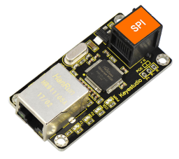
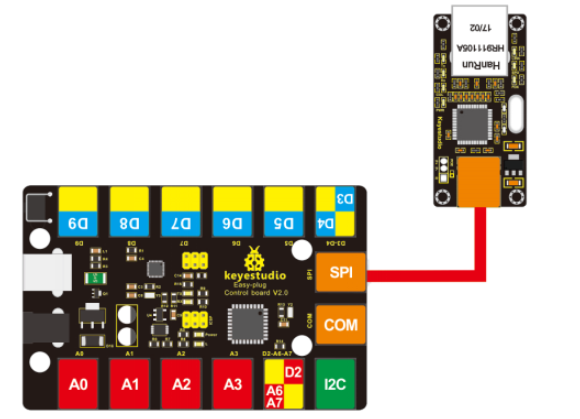
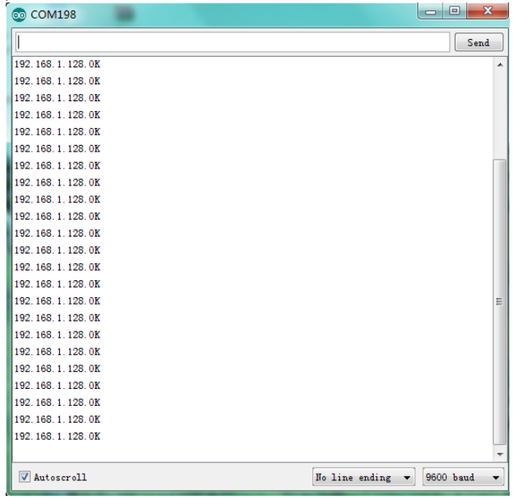

# KS0243 keyestudio EASY plug W5100 Ethernet Module




## 1. Introduction

W5100 is a multi-purpose single internet interface chip, integrated 10/100 Ethernet controller inside, and applied to embedded system which is high integration, high stability, high performance and low cost.

It can be connected to Internet without operating system and compatible with IEEE802.3 10BASE-T and 802.3u 100BASE-TX.

It contains TCP/IP protocol stack that is full-hardware and verified by market for years, Ethernet medium transport layer and physical layer.

You don’t need to consider the Ethernet control, and just need simple program for ports.

The module should be connected to the SPI communication interface on EASY plug control board with only one cable, so the wiring is rather simple.

**Special Note:**

The sensor/module is equipped with the RJ11 6P6C interface, compatible with our keyestudio EASY plug Control Board with RJ11 6P6C interface.

If you have the control board of other brands, it is also equipped with the RJ11 6P6C interface but has different internal line sequence, can’t be used compatibly with our sensor/module.

## 2. Specifications

- Various interface: Direct Bus, Indirect Bus and SPI Bus
- Supporting TCP/IP protocol stack of hardware, also TCP, UDP, ICMP, IGMP, IPv4, ARP and PPPoE
- Up to 4 independent ports
- Integrating 16KBYTE transmit-receive cache
- Supporting automatic conversion of polarity
- Coming with Internet access

## 3. Technical Details

- Dimensions: 61mm * 30mm * 18mm
- Weight: 14.1g

## 4. Connect It Up

Connect the EASY Plug W5100 Ethernet module to control board using an RJ11 cable. Then connect the control board to your PC with a USB cable.



## 5. Upload the Code

Download Resource:  [Resource](./Resource.7z)

Note： before uploading the code, you need to import the library files; otherwise, the code upload will fail.

```c
#include <SPI.h>
#include <Ethernet.h>
#include <Wire.h>
#include <LiquidCrystal_I2C.h>
LiquidCrystal_I2C lcd(0x27,20,4); 

// Enter a MAC address for your controller below.
// Newer Ethernet shields have a MAC address printed on a sticker on the shield
byte mac[] = {  0x00, 0xAA, 0xBB, 0xCC, 0xDE, 0x02 };

// Initialize the Ethernet client library
// with the IP address and port of the server 
// that you want to connect to (port 80 is default for HTTP): EthernetClient client;

void setup() 
{
  Serial.begin(9600);
  lcd.init();
  lcd.backlight();
}

void loop()
{
  delay(1000); 
  lcd.clear();
  lcd.setCursor(0,0);
  lcd.print("T ..."); 
  if (Ethernet.begin(mac) == 0)  
  {
    lcd.setCursor(0,1);
    lcd.print("W5100 Error!");
    Serial.println("W5100 Error!");
    while(1);
  }
  lcd.setCursor(0,1);
  for (byte thisByte = 0; thisByte < 4; thisByte++) 
  {
    lcd.print(Ethernet.localIP()[thisByte], DEC);
    lcd.print(".");
    Serial.print(Ethernet.localIP()[thisByte], DEC);
    Serial.print(".");
  }
  lcd.setCursor(14,1);
  lcd.print("OK");  
  Serial.println("OK");
  //while(1);
}
```

## 6. Result

Done uploading the test code, open the serial monitor and set the baud rate to 9600, you should be able to check the IP address that W5100 Ethernet module connected.

